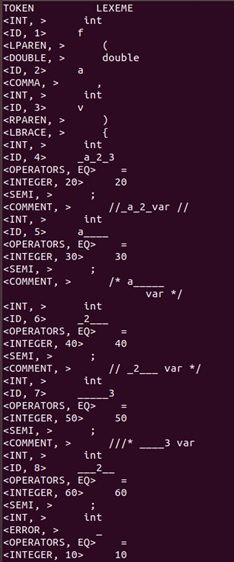
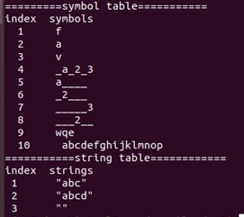

# Lexical analyzer

## 개요
텍스트 형식의 파일을 입력받아 어휘를 분석하는 lexical analyzer를 flex를 이용하여 구현한다.

## 사용된 환경 & version
- Ubuntu 18.04.1 LTS (64bit)
- gcc (Ubuntu 7.4.0-1ubuntu1~18.04.1) 7.4.0
- flex 2.6.4

## 사용 시 주의사항
### lex file을 flex를 이용하여 c 파일을 생성후 gcc로 컴파일 후 생성 된 object 파일을 이용하여 사용

```bash
flex hw1.l
gcc lex.yy.c -lf -lfl
./a.out ex1.txt
./a.out ex2.txt
```


#### 기능 설명
### TOKEN 종류
  
1.Keywords
  
-  int double str if while return
    
2.Identifiers (ID)

- 영문자 대소문자, 숫자, underscore(_)로만 이루어짐

- 첫 글자는 반드시 대소문자, _만 가능

- ‘_’문자만으로 이루어질 수는 없음

- 길이는 제한이 없으나 실제 구분은 첫 16자로 함
  
3.INTEGER

- 기본적으로 C 언어의 int 표기법을 따름 (십진수만 사용)

- 자리 수는 제한 없으나 값을 저장 시 최대 10자리만 저장(11자리 이상은 상위부분 절단)

4.DOUBLE
    
- C 언어의 double constant 표기법을 따름
  
5.STRING
    
- 기본적으로 C 언어의 표기법을 따름
  
6.Operators

- '+' '-'  '*'  '/'

- '='

- '>' '>=' '<' '<=' '==' '!='
 
7.기타 특수 문자들

- "  ,  (  ) ; { }
     
8.Comments

- C언어의 주석을 따른다 ( /* */ 와 // )


### 입력예시

int f ( int a, double b)

{

   int sum;
   
   sum = a + b;
   
   print(a, b, sum);
   
}

int sum ; sum print ( ;   **실제 문장구조는 체크하지 않으므로 실제 문법과 달라도 상관없음**

### 출력예시

- 1. 토큰들의 리스트 (token 옆에 lexeme을 함께 출력할 것)
- 
- 2. 심볼테이블 및 스트링 테이블
- 
